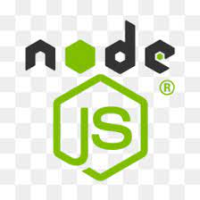
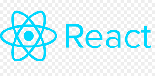

<h1 align="center">Jonathan (Jonny) Jefferies</h1>
<h3 align="center">Full Stack Web Developer</h3>

- Email: jonathanjefferies1985@gmail.com
- Portfolio: https://jj77847.github.io/updated-portfoilo/
- LinkedIn: https://www.linkedin.com/in/jonathan-jefferies-70916110b/

<h3 align="center">Languages and Tools</h3>

<h3 align="center" > Tools, languages, and other things that I like to work with.</h3>

<table align="center" >
  <tr>
    <td align="center" width="96">
        
       CSS
    </td>
    <td align="center" width="96">
        
       HTML
    </td>
    <td align="center" width="96">
        
       JQuery
    </td>
    <td align="center" width="96">
        
       JavaScript
    </td>
</tr>
<tr>
    <td align="center" width="96">
        
       MongoDB
    </td>
    <td align="center" width="96">
        
       NodeJS
    </td>
        <td align="center" width="96">
        
       Python
    </td>
    <td align="center" width="96">
        
       React
    </td>
    <td align="center" width="96">
        
       MySQL
    </td>
  </tr>
  
</table>

 
